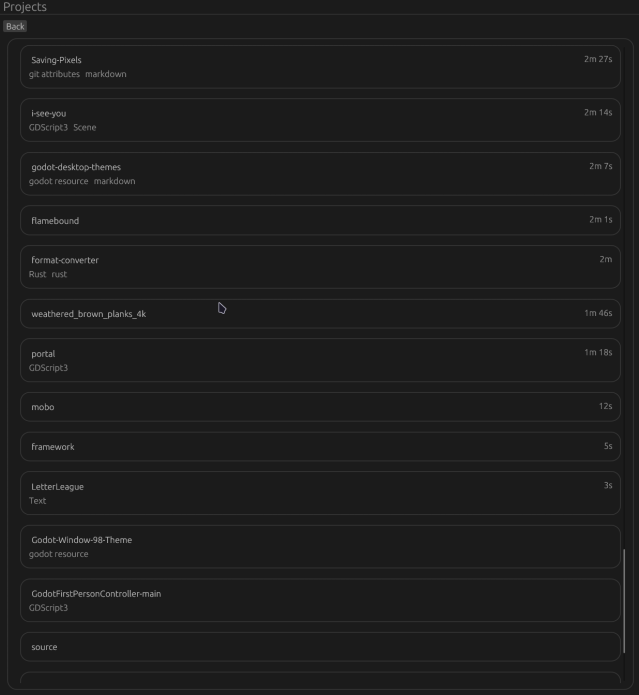

# rust-wakatime-dashboard

## Abstract
A native wakatime dashboard written in rust by a teenage dev. Work in progress, but currently has:
- OAthentication
- PKCE security
- User api call
- Projects api calls

## Screenshots

  
<strong>Projects showcase</strong>

  

## License

Distributed under the MIT License. See `LICENSE` for more information.
